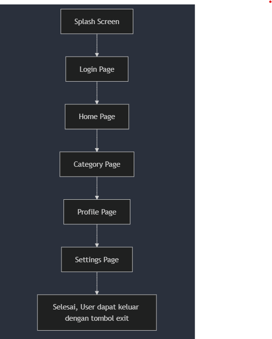

# Mobile Apps Pencarian Marketplace Kebutuhan Bahan Pangan "Pangan Mart"

A Pangan Mart Flutter project.

## Pendahuluan

Pangan Mart adalah aplikasi marketplace mobile yang inovatif, dirancang untuk memudahkan konsumen. Dengan meningkatnya permintaan akan akses yang mudah terhadap produk makanan segar dan berkualitas, Pangan Mart bertujuan untuk menyederhanakan proses pengadaan bagi konsumen. Dokumen ini menjelaskan strategi pengembangan, peluncuran, dan operasi berkelanjutan dari aplikasi Pangan Mart.

## Objective

- **Meningkatkan Aksesibilitas**: Mempermudah konsumen dalam menemukan dan membeli bahan pangan segar dari pemasok lokal.
- **Mendukung Pemasok Lokal**: Memberikan platform bagi petani dan pemasok untuk menjangkau pasar yang lebih luas dan meningkatkan penjualan mereka.
- **Meningkatkan Kualitas Produk**: Menjamin bahwa semua produk yang terdaftar di platform adalah segar dan memenuhi standar kualitas yang tinggi.
- **Membangun Komunitas**: Menciptakan ekosistem di mana konsumen dan pemasok dapat berinteraksi dan membangun hubungan yang saling menguntungkan.

## Scope

**Batasan**:

- Tidak ada batasan akses.
  **Kriteria**
- Konsumen dapat mencari bahan pahan dengan mudah melalui fitur category dan fitur searc/pencarian.

## Business Requirement Definition

**Jenis Layanan**: Layanan Marketplace Kebutuhan Bahan Pangan
**Definisi**:
Layanan marketplace untuk bahan pangan adalah platform digital yang memudahkan konsumen dalam mencari kebutuhan pangan. Layanan ini memungkinkan pembeli untuk mencari produk dengan nama produk dan category produk. Aplikasi ini menawarkan fitur seperti pencarian produk dan penjelajahan kategori.

**Abstrak**
Layanan marketplace bahan pangan merevolusi cara bahan pangan dibeli dengan membawa semua pemangku kepentingan ke satu platform. Ini menyediakan metode yang nyaman, efisien, dan transparan untuk perdagangan bahan pangan. Pembeli dapat membandingkan harga, mencari produk berdasarkan kategori dan membuat keputusan pembelian yang berdasarkan informasi. Layanan ini bertujuan untuk merampingkan rantai pasokan makanan, mengurangi limbah makanan, dan mempromosikan sumber daya lokal dan berkelanjutan.

**Penjelasan Fungsi**

Fungsi Teknis:

- **Splash Screen**: Menampilkan spleash screen selama 3 detik.
- **Login View**: Pada fitur ini berisi tampilan login berupa email dan password, untuk demo aplikasi gunakan email: **user@user.com** dan password: **password**.
- **Home View**: Menampilkan Home View dengan produk unggulan.
- **Category View**: Menampilkan detail produk dengan fitur search dan category.
- **Profile Page**: Menampilkan informasi email, no telp, dan alamat.
- **Settings Page**: Menampilkan halaman settings dan tombol keluar

**Process Flows**

- Splash Screen (3 detik)
- User memasukan email dan password
- User membuka halaman home dengan tampilan Produk Unggulan
- User membuka halaman category, menampilan produk detail dengan fitur pencarian produk dan category produk
- User membuka halaman profile, menampilkan profile page berupa nama, email, no telpon, dan alamat
- User keluar aplikasi melalui halaman settings

**Spesifikasi**

- Freamewok: Flutter
- Pubspec Asset: Menggunakan image asset file
- Controllers:
  --home_controller.dart untuk logic navigasi halaman
  --login_controller.dart untuk logic login menggunakan controller email dan password
  --product_controller.dart untuk mengisi data product
  --search_controller.dart untuk logic pencarian product pada halaman category page
